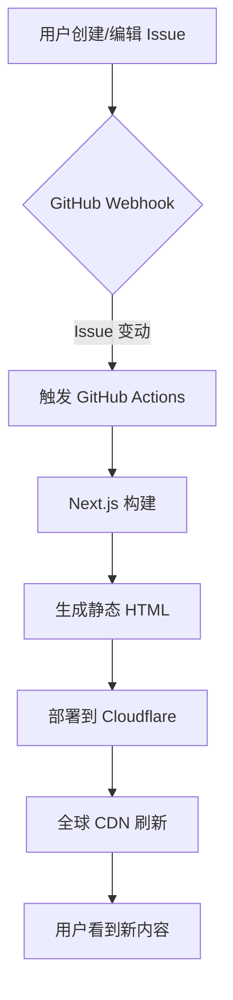

# 零成本搭建个人博客：GitHub Issues + Cloudflare 完整教程

> 用 GitHub 写内容，用 Cloudflare 托管，完全免费，自动化部署。

---

## 前言

作为一个 ADHD 创作者，我一直在寻找一种**足够简单、零 friction** 的写作方式。

传统的博客系统（WordPress、Hexo、Hugo）都有一些问题：
- 需要本地写 Markdown，然后 push 到仓库
- 发布流程繁琐，需要等待构建
- 编辑器体验不够好

而我想要的很简单：**在手机上随手写点什么，点一下发布，就能出现在博客上**。

这套基于 GitHub Issues + Cloudflare 的博客系统，就是我找到的最佳方案。

---

## 一、技术栈

### 1.1 整体架构

```
┌─────────────────┐     ┌─────────────────┐     ┌─────────────────┐
│   GitHub Issues │────▶│   Next.js (SSG) │────▶│  Cloudflare     │
│   (内容管理)     │     │   (静态生成)     │     │  Pages (托管)   │
└─────────────────┘     └─────────────────┘     └─────────────────┘
        │                                               │
        │         GitHub Actions (自动化构建)            │
        └───────────────────────────────────────────────┘
```

### 1.2 核心技术选型

| 技术 | 用途 | 为什么选择它 |
|------|------|-------------|
| **GitHub Issues** | CMS 内容管理 | 原生支持 Markdown，自带标签系统，手机端体验好，无需额外数据库 |
| **Next.js 14** | 前端框架 | App Router + Static Site Generation，ISR 支持，React 生态 |
| **TypeScript** | 类型安全 | 更好的开发体验，减少运行时错误 |
| **Tailwind CSS** | 样式系统 | 原子化 CSS，快速构建响应式界面，暗色模式支持 |
| **Cloudflare Pages** | 静态托管 | 全球 CDN，免费额度充足，自动 HTTPS，与 GitHub 集成好 |
| **GitHub Actions** | CI/CD | 自动化构建和部署，Issue 变动时自动触发 |

### 1.3 关键设计决策

#### 为什么用 GitHub Issues 而不是 Markdown 文件？

1. **编辑器体验**：GitHub 的手机 App 和网页编辑器都很完善，支持 Markdown 实时预览
2. **标签系统**：原生支持标签，可以用来做文章分类和过滤
3. **评论系统**：自带评论区（虽然我没有直接使用）
4. **无需本地环境**：随时随地可以写，不受设备限制
5. **版本历史**：自动保存修改历史，误删可恢复

#### 为什么用 Next.js SSG 而不是其他方案？

1. **ISR (增量静态再生成)**：可以设置页面自动刷新间隔，不用每次发文章都重新构建
2. **静态导出**：`output: 'export'` 生成纯 HTML，适合 Cloudflare Pages
3. **App Router**：新的路由系统，支持 React Server Components
4. **Image Optimization**：虽然静态导出时受限，但架构上支持

---

## 二、写作流程与触发机制

### 2.1 整个写作流程

这套系统的核心理念是：**内容即代码，Issue 即文章**。

```
日常灵感 ──▶ 打开 GitHub App ──▶ 创建 Issue ──▶ 写文章 ──▶ 打标签 ──▶ 发布
                                      │
                                      ▼
                              [自动化流程启动]
                                      │
                    ┌─────────────────┼─────────────────┐
                    ▼                 ▼                 ▼
              GitHub Actions    Cloudflare Build    网站更新
              触发构建          拉取最新内容        自动完成
```

#### 实际写作体验

1. **地铁上想到一个点子** → 打开 GitHub App
2. **点击 Issues → New Issue**
3. **写标题和内容**（支持 Markdown）
4. **添加标签**：
   - `blog` - 普通文章
   - `thought` - 碎片想法（会显示在 Thoughts 页面）
   - `hidden` - 隐藏（草稿，不显示在博客）
5. **点击 Submit** → 完成！

大概 5-10 秒后，内容就会出现在博客上。

### 2.2 自动化的触发流程



#### 技术实现细节

**GitHub Actions 配置** (`.github/workflows/deploy.yml`):

```yaml
name: Deploy to Cloudflare Pages

on:
  issues:
    types: [opened, edited, deleted, closed, reopened]
  workflow_dispatch:

jobs:
  deploy:
    runs-on: ubuntu-latest
    steps:
      - uses: actions/checkout@v4
      - uses: actions/setup-node@v4
        with:
          node-version: 20
      - run: npm ci
      - run: npm run build
      - name: Deploy to Cloudflare
        uses: cloudflare/wrangler-action@v3
        with:
          apiToken: ${{ secrets.CLOUDFLARE_API_TOKEN }}
          command: pages deploy dist --project-name=your-project
```

这个配置的关键点：
- `on: issues` - 监听所有 Issue 变动事件
- `types` - 包括创建、编辑、删除、关闭、重新打开
- `workflow_dispatch` - 支持手动触发

### 2.3 博客功能如何触发

#### 标签系统的设计

我们设计了三个层级的标签系统：

| 标签 | 作用 | 显示位置 |
|------|------|---------|
| 无标签或任意标签 | 普通文章 | Home 页面 |
| `thought` | 碎片想法 | Thoughts 页面 |
| `hidden`/`hide` | 隐藏内容 | 不显示 |

#### 数据获取逻辑

```typescript
// lib/api.ts - 核心过滤逻辑

export async function getAllPosts(): Promise<Post[]> {
  const issues = await fetchGitHubAPI(
    `https://api.github.com/repos/${REPO_OWNER}/${REPO_NAME}/issues?state=all&per_page=100`
  );

  const authorIssues = issues.filter((issue: GitHubIssue) => {
    // 只显示作者自己创建的
    if (!issue.user || issue.user.login !== REPO_OWNER) return false;

    const labels = issue.labels?.map((label: string | GitHubLabel) =>
      typeof label === 'string' ? label : label.name
    ) || [];

    // 排除 hidden/hide 标签
    if (labels.some((l: string) => l.toLowerCase() === 'hide' || l.toLowerCase() === 'hidden')) {
      return false;
    }

    // 排除 thought 标签（只在 thoughts 页面显示）
    if (labels.some((l: string) => l.toLowerCase() === 'thought')) {
      return false;
    }

    return true;
  });

  return authorIssues.map(/* ... */);
}
```

#### ISR (增量静态再生成)

```typescript
// app/page.tsx
export const revalidate = 600; // 每 10 分钟重新生成
```

即使没有触发 GitHub Actions，博客也会每隔 10 分钟检查一次新内容。

### 2.4 特点和优点

#### 对写作者友好

1. **零 friction 写作**：不需要打开 IDE，不需要 git commit/push
2. **移动端支持**：GitHub App 的编辑器足够好用
3. **即时反馈**：发布 Issue 后 10 秒内就能看到效果
4. **版本控制**：Issue 的编辑历史自动保存

#### 对开发者友好

1. **纯静态站点**：Cloudflare Pages 免费托管，全球 CDN 加速
2. **零服务器成本**：没有数据库费用，没有服务器维护
3. **自动化**：完全自动化的构建和部署流程
4. **类型安全**：TypeScript 保证代码质量

#### 扩展性

1. **标签系统灵活**：可以自定义任意标签来做分类
2. **API 丰富**：GitHub API 可以获取评论、反应等数据
3. **多平台**：可以同时同步到多个平台（如果有需要）

---

## 三、实现原理与操作步骤

### 3.1 整体架构原理

这套系统的核心思路是**把 GitHub Issues 当作数据库使用**：

1. **内容存储**：GitHub Issues 存储文章标题、内容、标签、创建时间
2. **内容获取**：通过 GitHub REST API 获取 Issues 列表
3. **内容渲染**：Next.js 在构建时获取数据，生成静态 HTML
4. **内容分发**：Cloudflare Pages 提供全球 CDN 加速

### 3.2 从零开始搭建（详细步骤）

#### 第一步：创建 GitHub 仓库

1. 登录 GitHub，创建新仓库（如 `MyBlog`）
2. 不需要初始化，保持空仓库即可
3. 记录仓库名和用户名，后续会用到

#### 第二步：创建 Next.js 项目

```bash
npx create-next-app@14 my-blog --typescript --tailwind --eslint --app --no-src-dir

cd my-blog
```

#### 第三步：配置静态导出

修改 `next.config.mjs`：

```javascript
/** @type {import('next').NextConfig} */
const nextConfig = {
  output: 'export',
  distDir: 'dist',
  images: {
    unoptimized: true,  // 静态导出需要关闭图片优化
  },
};

export default nextConfig;
```

#### 第四步：创建 API 层

创建 `lib/api.ts`：

```typescript
import { Post } from '@/types';

const GITHUB_TOKEN = process.env.NEXT_PUBLIC_GITHUB_TOKEN || '';
const REPO_OWNER = '你的GitHub用户名';
const REPO_NAME = '你的仓库名';

interface GitHubIssue {
  number: number;
  title: string;
  body: string;
  created_at: string;
  user: { login: string };
  labels: (string | { name: string })[];
}

async function fetchGitHubAPI(url: string) {
  const headers: HeadersInit = {
    'Accept': 'application/vnd.github.v3+json',
  };

  if (GITHUB_TOKEN) {
    headers['Authorization'] = `Bearer ${GITHUB_TOKEN}`;
  }

  const response = await fetch(url, { headers });
  if (!response.ok) return null;
  return response.json();
}

export async function getAllPosts(): Promise<Post[]> {
  const issues = await fetchGitHubAPI(
    `https://api.github.com/repos/${REPO_OWNER}/${REPO_NAME}/issues?state=all&per_page=100`
  );

  if (!issues || !Array.isArray(issues)) return [];

  // 过滤掉 hidden 标签和别人的 issues
  const filtered = issues.filter((issue: GitHubIssue) => {
    if (issue.user?.login !== REPO_OWNER) return false;
    
    const labels = issue.labels?.map(l => 
      typeof l === 'string' ? l : l.name
    ) || [];
    
    return !labels.some(l => 
      l.toLowerCase() === 'hide' || l.toLowerCase() === 'hidden'
    );
  });

  return filtered.map((issue: GitHubIssue) => ({
    id: issue.number,
    title: issue.title,
    content: issue.body || '',
    created_at: issue.created_at,
    labels: issue.labels?.map(l => typeof l === 'string' ? l : l.name) || [],
  }));
}
```

#### 第五步：创建页面

创建 `app/page.tsx`：

```tsx
import { getAllPosts } from "@/lib/api";

export const revalidate = 600;

export default async function Home() {
  const posts = await getAllPosts();

  return (
    <div className="max-w-3xl mx-auto px-4 py-16">
      <h1 className="text-4xl font-bold mb-8">我的博客</h1>
      <div className="space-y-6">
        {posts.map((post) => (
          <article key={post.id} className="border-b pb-6">
            <a href={`/post/${post.id}`}>
              <h2 className="text-xl font-semibold hover:text-blue-600">
                {post.title}
              </h2>
            </a>
            <time className="text-sm text-gray-500">
              {new Date(post.created_at).toLocaleDateString()}
            </time>
          </article>
        ))}
      </div>
    </div>
  );
}
```

创建 `app/post/[id]/page.tsx`：

```tsx
import { getPostById, getAllPosts } from "@/lib/api";
import MarkdownRenderer from "@/components/MarkdownRenderer";

export const revalidate = 600;

// 预生成所有文章页面
export async function generateStaticParams() {
  const posts = await getAllPosts();
  return posts.map((post) => ({
    id: post.id.toString(),
  }));
}

export default async function PostPage({ 
  params 
}: { 
  params: { id: string } 
}) {
  const post = await getPostById(parseInt(params.id));
  
  if (!post) return <div>文章未找到</div>;

  return (
    <article className="max-w-3xl mx-auto px-4 py-16">
      <h1 className="text-3xl font-bold mb-4">{post.title}</h1>
      <time className="text-sm text-gray-500">
        {new Date(post.created_at).toLocaleDateString()}
      </time>
      <div className="mt-8 prose dark:prose-invert">
        <MarkdownRenderer content={post.content} />
      </div>
    </article>
  );
}
```

#### 第六步：部署到 Cloudflare Pages

1. **安装 Wrangler**:
   ```bash
   npm install -g wrangler
   ```

2. **登录 Cloudflare**:
   ```bash
   wrangler login
   ```

3. **创建 Pages 项目**:
   ```bash
   wrangler pages project create my-blog
   ```

4. **获取 API Token**:
   - 访问 https://dash.cloudflare.com/profile/api-tokens
   - 创建新 Token，选择 "Edit Cloudflare Workers"
   - 复制 Token

5. **添加到 GitHub Secrets**:
   - 进入 GitHub 仓库 → Settings → Secrets and variables → Actions
   - 添加 `CLOUDFLARE_API_TOKEN`

6. **创建 GitHub Actions 工作流**:
   创建 `.github/workflows/deploy.yml`（见上文配置）

#### 第七步：配置自定义域名（可选）

1. 在 Cloudflare Dashboard → Pages → 你的项目 → Custom domains
2. 添加你的域名
3. 按提示配置 DNS 记录

### 3.3 日常使用流程

#### 写文章

1. 打开 GitHub App 或网页
2. 进入 Issues → New Issue
3. 填写标题和内容（Markdown 格式）
4. 添加标签（可选）
5. Submit

#### 修改文章

直接编辑 Issue，博客会自动更新。

#### 删除/隐藏文章

- 给 Issue 添加 `hidden` 标签
- 或直接关闭 Issue
- 或删除 Issue

#### 草稿模式

创建 Issue 时添加 `hidden` 标签，写完后再移除。

---

## 四、进阶优化

### 4.1 添加评论系统

可以使用 GitHub Issues 的评论功能：

```typescript
// 获取文章评论
async function getIssueComments(issueNumber: number) {
  return fetchGitHubAPI(
    `https://api.github.com/repos/${REPO_OWNER}/${REPO_NAME}/issues/${issueNumber}/comments`
  );
}
```

### 4.2 添加搜索功能

由于所有内容都是静态生成的，可以：
- 构建时生成搜索索引 JSON
- 使用客户端搜索库（如 Fuse.js）

### 4.3 添加 RSS 订阅

创建 `app/rss.xml/route.ts`：

```typescript
export async function GET() {
  const posts = await getAllPosts();
  
  const rss = `<?xml version="1.0" encoding="UTF-8" ?>
    <rss version="2.0">
      <channel>
        <title>我的博客</title>
        <link>https://your-domain.com</link>
        ${posts.map(post => `
          <item>
            <title>${post.title}</title>
            <link>https://your-domain.com/post/${post.id}</link>
            <pubDate>${new Date(post.created_at).toUTCString()}</pubDate>
          </item>
        `).join('')}
      </channel>
    </rss>`;

  return new Response(rss, {
    headers: { 'Content-Type': 'application/xml' },
  });
}
```

### 4.4 性能优化

1. **图片处理**：使用 Cloudflare Images 或外部图床
2. **缓存策略**：合理配置 `revalidate` 时间
3. **CDN**：Cloudflare 自动提供全球 CDN

---

## 五、总结

这套方案的核心优势：

| 方面 | 传统方案 | 本方案 |
|------|---------|--------|
| **写作体验** | 需要本地编辑器 | GitHub Issues，随时随地 |
| **发布流程** | commit → push → wait | 点击 Submit，10 秒上线 |
| **成本** | 服务器/VPS 费用 | 完全免费 |
| **维护** | 需要维护服务器 | 零维护 |
| **性能** | 依赖服务器 | 全球 CDN |
| **数据安全** | 自己备份 | GitHub 自动备份 |

### 适用场景

✅ **适合**:
- 个人博客
- 技术笔记
- 碎片想法记录
- 不想维护服务器的懒人（比如我）

❌ **不适合**:
- 需要复杂权限管理的团队博客
- 有大量图片/视频的多媒体站点
- 需要实时协作的场景

### 最后

这套系统的核心理念是**简化**。

去掉所有不必要的步骤，让写作回归最纯粹的状态：

> 有想法 → 写下来 → 发布

仅此而已。

---

**我的实现**: https://github.com/QiYongchuan/MyGitBlog

如果你按照这个教程搭建了自己的博客，欢迎分享给我！
